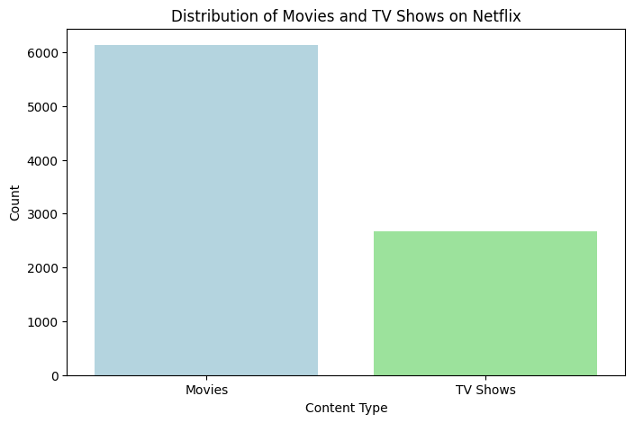
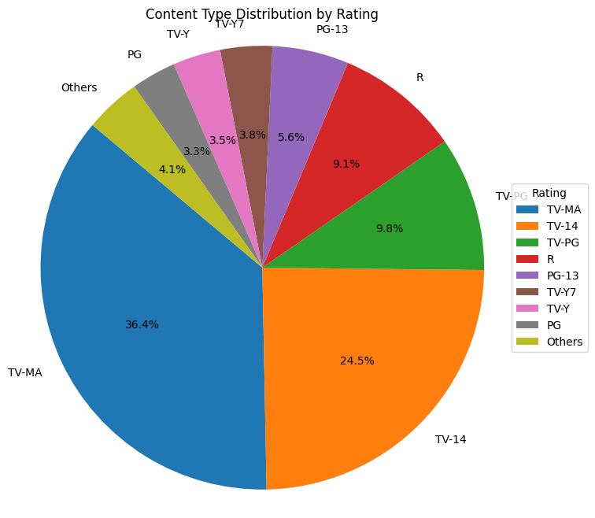
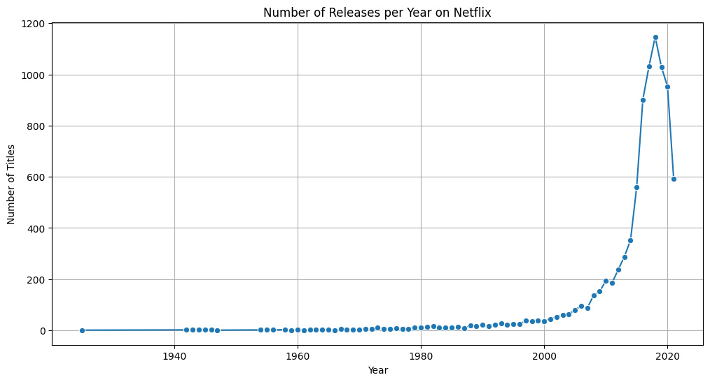

# 🎬 Netflix Movies & TV Shows EDA Project

## 📌 Project Overview
Netflix is one of the largest streaming platforms, offering a vast collection of movies and TV shows across genres and countries. Analyzing Netflix's catalog can reveal trends in content production, genre popularity, and global reach.

In this project, we perform **Exploratory Data Analysis (EDA)** on the Netflix titles dataset to uncover insights about content types, release years, genres, countries, and more. The dataset used is sourced from Kaggle:

➡️ [Netflix Movies and TV Shows (Kaggle)](https://www.kaggle.com/datasets/shivamb/netflix-shows)

---

## 🎯 Objectives
This project aims to:
1. Perform **EDA** on Netflix's movies and TV shows dataset.
2. Identify patterns in **content type, genre, and release year**.
3. Compare **countries, ratings, and directors**.
4. Visualize results with meaningful plots and charts.

---

## 📂 Dataset Description
The dataset contains details of movies and TV shows available on Netflix, including title, director, cast, country, date added, release year, rating, duration, and genre.

Files used:
- `netflix_titles.csv` → Main dataset with all titles

---

## 📊 Visualizations

- 📊 **Bar chart** showing Movies vs TV Shows distribution



- 🌍 **Horizontal bar chart** of Top 10 countries by content count


- 🎭 **Pie chart** showing content type distribution by rating



- 📈 **Line plot** showing number of releases per year




---

## ⚙️ Tools & Libraries Used
- **Python** 🐍
- **NumPy** – Numerical operations
- **Matplotlib & Seaborn** – Data visualization
- **Jupyter Notebook** – Development environment
---

## 📌 Results & Insights
- Found **trends in content addition** over the years.
- Compared **ratings distribution** and **duration patterns**.
- Highlighted **prolific directors and actors**.

---
## 🚀 How to Run

**Clone the Repository**  

   ```bash
   git clone https://github.com/emadadnan000/Netflix-Movies-and-TV-Shows-EDA.git
   cd Air-Quality-Insights-EDA
   ```

--- 
## 👤 Author
- **Emad Adnan (SMIT Project)**
- 🌐 GitHub: [EmadAdnan](https://github.com/emadadnan000)
- 🔗LinkedIn:  [EmadAdnan](https://www.linkedin.com/in/emad-adnan/)
